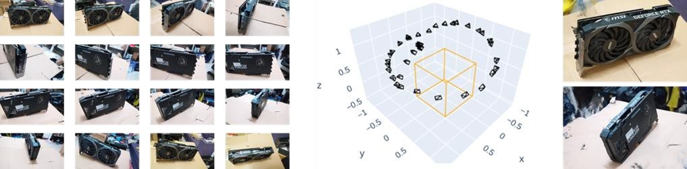
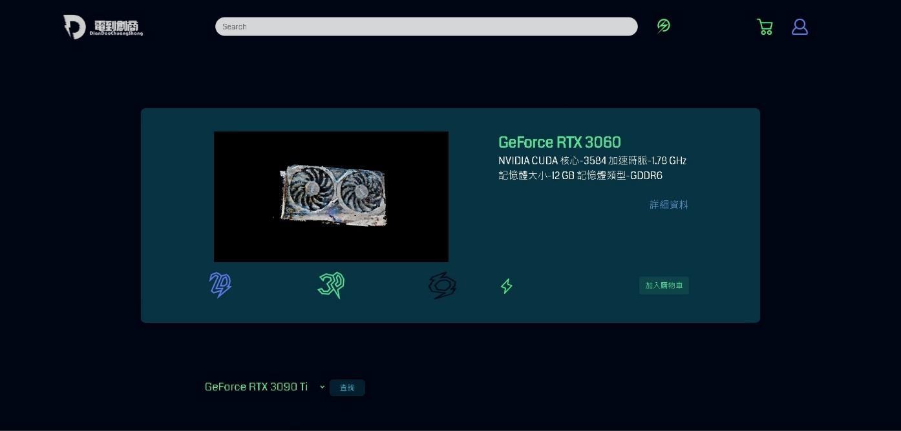

# 大學專題：重建生機 - 3D 模型電商平台

### 最終成果展示

## 專案簡介
本專案旨在解決電商平台商品展示單一的問題。我們開發了一套系統，能將使用者上傳的多張 2D 產品照片，透過 AI 演算法自動重建為可互動的 3D 模型，並嵌入網頁中，大幅提升使用者體驗。

## 技術棧
* **後端框架:** Django
* **AI / 影像處理:** Python, PyTorch, OpenCV
* **前端:** JavaScript, HTML/CSS

## 核心流程
如上圖所示，系統的核心流程包含：
1.  **影像輸入:** 收集並上傳產品的多角度 2D 照片。
2.  **空間定位與重建:** 演算法會分析照片，計算出每張照片的相對相機位置，並據此重建出 3D 點雲與模型。
3.  **模型輸出與展示:** 將生成的 3D 模型檔案，透過網頁前端技術進行渲染與互動式展示。
